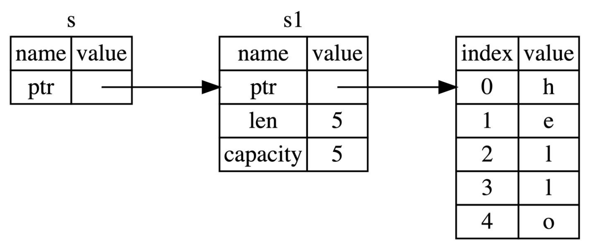
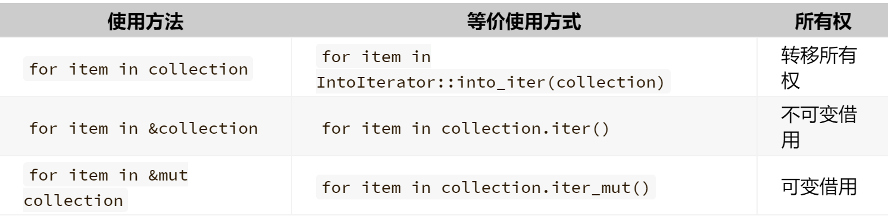

# Rust语言圣经笔记


## 1 开始

Rust特点：无 GC 且无需手动内存管理、性能高、工程性强、语言级安全性以及能同时得到工程派和学院派认可的语言。

（基于表达式的语言，非面向对象或函数式语言，所有权、借用、生命周期、智能指针）


包管理工具：cargo

```
cargo new project_name

cargo run //默认debug模式，编译快运行慢，有debug输出行
cargo build

cargo run --release //release模式，经过优化，编译慢运行快
cargo build --release

cargo check //快速的检查一下代码能否编译通过
```

- `Cargo.toml` 是**项目数据描述文件**，按照期望的方式进行构建、测试和运行。
- `Cargo.lock` 是**项目依赖详细清单**，一般不用修改它。当项目是一个可运行的程序时，就上传 `Cargo.lock`，如果是一个依赖库项目，那么请把它添加到 `.gitignore` 中。


注意：仔细阅读编译错误和警告。


## 2 Rust基础入门

### 2.2 基本类型

`isize` 和 `usize` 类型取决于程序运行的计算机 CPU 类型，主要应用场景是用作集合的索引。

在 `debug` 模式编译时，Rust 会检查整型溢出，若存在这些问题，则使程序在编译时 *panic*；使用 `--release` 参数进行 release 模式构建时，Rust **不**检测溢出。

要显式处理可能的溢出，可以使用标准库针对原始数字类型提供的这些方法：

- 使用 `wrapping_*` 方法在所有模式下都按照补码循环溢出规则处理，例如 `wrapping_add`
- 如果使用 `checked_*` 方法时发生溢出，则返回 `None` 值
- 使用 `overflowing_*` 方法返回该值和一个指示是否存在溢出的布尔值
- 使用 `saturating_*` 方法使值达到最小值或最大值

下面是一个演示`wrapping_*`方法的示例：

```rust
fn main() {
    let a : u8 = 255;
    let b = a.wrapping_add(20);
    println!("{}", b);  // 19
}
```


默认浮点类型是 `f64`。避免在浮点数上测试相等性。可以考虑用这种方式 `(0.1_f64 + 0.2 - 0.3).abs() < 0.00001` 。

```Rust
std::mem::size_of_val(&x)
```

当用 `!` 作函数返回类型的时候，表示该函数永不返回( diverge function )

### 2.3 所有权和借用

一个值（内存空间）只允许有一个所有者

#### 堆和栈

1 栈中的所有数据都必须占用已知且固定大小的内存空间；与栈不同，对于大小未知或者可能变化的数据，我们需要将它存储在堆上，堆是一种缺乏组织的数据结构。

2 栈数据往往可以直接存储在 CPU 高速缓存中，而堆数据只能存储在内存中，处理器处理和分配在栈上数据会比在堆上的数据更加高效。

3 因为堆上的数据缺乏组织，因此跟踪这些数据何时分配和释放是非常重要的，否则堆上的数据将产生内存泄漏 —— 这些数据将永远无法被回收。这就是 Rust **所有权系统**为我们提供的强大保障。


#### 以String为例——所有权转移 (move)

```rust
let s1 = "hello"; // 类型为&str，是堆上数据“hello”的一个不可变引用，没有所有权。
let mut s2 = String::from("hello"); //动态字符串类型String（非基本类型），“hello”分配在堆上，s2对其有所有权。
let s3 = s2; //这里发生了借用，s2失效，s3继承其所有权。
println!("{}", s2);//Error！
let s4 = s1; //s1不会失效，s1和s4引用同一块内存。
let s5 = s3.clone();//深拷贝，s3仍然有效。
```

**Rust 永远也不会自动创建数据的 “深拷贝“。**如果我们需要，可以使用一个叫做 `clone` 的方法（非基本类型需要，基本类型或是可copy类型深浅拷贝无区别）。


<u>注意！！！在函数调用中，参数是可copy类型则自动复制一份传入函数，函数结束后该值仍可用；而若是非可copy类型，则**所有权转移**，原变量不可用。</u>


#### 借用（borrow）——可变&/不可变&mut



```rust
fn main() {
    let s1 = String::from("hello");
    let len = calculate_length(&s1);
    println!("The length of '{}' is {}.", s1, len);
}
fn calculate_length(s: &String) -> usize {//这里&String类型是不可变引用，是可copy类型，因此调用时发生的是引用。
    s.len()
}
```

`s1` 的引用作为参数传递给 `calculate_length` 函数，而不是把 `s1` 的所有权转移给该函数。

**同一作用域，特定数据只能有一个可变引用**：

```rust
let mut s = String::from("hello");

let r1 = &mut s;
let r2 = &mut s;

println!("{}, {}", r1, r2); // Error！
```

这种限制的好处就是使 Rust 在编译期就避免数据竞争，数据竞争可由以下行为造成：

- 两个或更多的指针同时访问同一数据
- 至少有一个指针被用来写入数据
- 没有同步数据访问的机制

**可变引用与不可变引用不能同时存在：**

```rust
let mut s = String::from("hello");

let r1 = &s; // 没问题
let r2 = &s; // 没问题
let r3 = &mut s; // 大问题

println!("{}, {}, and {}", r1, r2, r3);
```

**Non-Lexical Lifetimes(NLL)**

引用的作用域 `s` 从创建开始，一直持续到它*最后一次使用的地方*，这个跟变量的作用域有所不同，变量的作用域从创建持续到某一个花括号 `}`

是对Rust老版本的一种改进，编译跟容易通过。


在 Rust 中编译器可以确保引用永远也不会变成悬垂状态（Dangling Reference）


### 2.4 复合类型

```rust
#![allow(unused_variables)]  //编译器属性标记，对整个文件有效
type File = String;

fn open(f: &mut File) -> bool {
    true
}
fn close(f: &mut File) -> bool {
    true
}

#[allow(dead_code)]          //编译器属性标记，对该行下面的块有效
fn read(f: &mut File, save_to: &mut Vec<u8>) -> ! {
    unimplemented!()         //告诉编译器该函数尚未实现,类似的还有todo!()
}

fn main() {
    let mut f1 = File::from("f1.txt");
    open(&mut f1);
    //read(&mut f1, &mut vec![]); //若取消注释，会报错，由于unimplemented的存在
    close(&mut f1);
}
```

#### 2.4.1 字符串和切片

##### 切片用法

```rust
let s = String::from("hello");
let len = s.len();

let slice = &s[4..len];//等效于&s[4..]
let slice = &s[0..2];  //等效于&s[..2]
let slice = &s[0..len];//等效于&s[..]

let s = "中国人";
println!("{}", &s[0..2]);//Error！一个中文占三个字节(byte)
for c in "中国人".chars() {
    println!("{}", c);   //Right！
}
```

下面的代码会报错：

```rust
fn main() {
    let mut s = String::from("hello world");
    let word = first_word(&s); //产生一个s的不可变引用
    s.clear(); // error!clear(&mut self)会产生一个s的不可变引用，而rust中可变引用和不可变引用不能共存
    println!("the first word is: {}", word);//s的不可变引用到这里结束
}
fn first_word(s: &String) -> &str {
    &s[..1] 
}
```

##### String和&str的区别

Rust 在语言级别，只有一种字符串类型： `str`，它通常是以引用类型出现 `&str`，也就是上文提到的字符串切片。虽然语言级别只有上述的 `str` 类型，但是在标准库里，还有多种不同用途的字符串类型，其中使用最广的即是 `String` 类型。

`str` 类型是硬编码进可执行文件，也无法被修改，但是 `String` 则是一个可增长、可改变且具有所有权的 UTF-8 编码字符串，**当 Rust 用户提到字符串时，往往指的就是 `String` 类型和 `&str` 字符串切片类型，这两个类型都是 UTF-8 编码**。(UTF-8不能保证索引的复杂度是O(1)，得从头扫描。)

除了 `String` 类型的字符串，Rust 的标准库还提供了其他类型的字符串，例如 `OsString`， `OsStr`， `CsString` 和` CsStr` 等，注意到这些名字都以 `String` 或者 `Str` 结尾了吗？它们分别对应的是具有所有权和被借用的变量。

`String` 类型是一个复杂类型，由存储在栈中的堆指针、字符串长度、字符串容量共同组成，其中堆指针是最重要的。

`&str`有两个字段，字符串开始的堆指针和字符串查长度。

```rust
let mut my_name = "Pascal".to_string();
my_name.push_str( " Precht");
let last_name = &my_name[7..];//字符串切片常以引用&str类型出现。
```


```rust
fn main() {
  let first_name = "Pascal";
  let last_name = "Precht".to_string();

  greet(first_name);
  greet(&last_name); // `last_name` is passed by reference,这里发生了一次隐式类型转换，&string->&str
}

fn greet(name: &str) {
  println!("Hello, {}!", name);
}
```

##### 一些操作函数

```rust
let mut s = String::from("Hello ");
s.push('r');
s.push_str("ust! Learning rust is my favorate.");

s.insert(5, ",");
s.insert_str(6,"I like ");

//返回一个新的字符串，而不操作原来的字符串。
let s1 = s.replace("rust", "RUST");
let s2 = s.replace("rust", "RUST", 1)
//直接操作原来的字符串，不返回新字串，需要使用 mut 关键字修饰
s.repalce_range(7..8, "R");
```

四个删除函数：

`pop` —— 删除并返回字符串的最后一个字符，操作原字符串。

 `remove` —— 删除并返回字符串中指定位置的字符，操作原字符串。按照字节来处理字符串的，如果参数所给的位置不是**合法的字符边界(新的字符开始的下标)**，则会发生错误。

```rust
let mut string_remove = String::from("测试remove方法");
string_remove.remove(0);//Right!"试remove方法"
string_remove.remove(1);//Error!
string_remove.remove(3);//Right!"试emove方法"
```

`truncate` —— 删除字符串中从指定位置开始到结尾的全部字符，操作原来的字符串。

`clear` —— 清空字符串，直接操作原来的字符串。

```rust
//字符串连接
let string_append = String::from("hello ");
let string_rust = String::from("rust");
let result = string_append + &string_rust;//注意这里string_rust要加&，而string_append的所有权转移到result。
let mut result = result + "!";
result += "!!!";

let result2 = result.add("addtest");//result的所有权被转移，不可再使用。

let s1 = "hello";
let s2 = String::from("rust");
let s = format!("{} {}!", s1, s2);//新建了一个String，s1\s2仍然可用，所有权未变更
```

```rust
//转义
let byte_escape = "I'm writing \x52\x75\x73\x74!";
let unicode_codepoint = "\u{211D}";
let character_name = "\"DOUBLE-STRUCK CAPITAL R\"";

// 换行了也会保持之前的字符串格式
let long_string = "String literals
                can span multiple lines.
                The linebreak and indentation here ->\
                <- can be escaped too!";

//不转义
println!("{}", "hello \\x52\\x75\\x73\\x74");
let raw_str = r"Escapes don't work here: \x3F \u{211D}";

// 如果字符串包含双引号，可以在开头和结尾加 #
let quotes = r#"And then I said: "There is no escape!""#;
let longer_delimiter = r###"A string with "# in it. And even "##!"###;
```

推荐用的库[utf8_slice](https://crates.io/crates/utf8_slice)。

rust是无GC语言，变量在离开作用域后，就自动释放其占用的内存（自动调用drop函数）。

#### 2.4.2 元组

```rust
let x: (i32, f64, u8) = (500, 6.4, 1);
let tup = (500, 6.4, 1);
let five_hundred = x.0;
// 常用于函数返回
fn calculate_length(s: String) -> (String, usize) {
    let length = s.len();
    (s, length)
}
```

#### 2.4.3 结构体

```rust
#[derive(Debug)] //此标记可以用println!("{:?}")或"{:#?}"打印结构体,dbg!(&user1)也可以;不加标记的话可以自己实现display特征，用"{}"输出即可
struct User {
    active: bool,
    username: String,
    email: String,   //这里有意设为需要所有权的类型，使得结构体拥有它是所有数据；若使用引用类型，则必须引入生命周期
    sign_in_count: u64,
}

let user2 = User {        
    email: String::from("another@example.com"),             ..user1    //user1所有权部分转移(username)，因此user1不能再被使用，但部分字段仍可使用。
};

//元组结构体
struct Color(i32, i32, i32); //结构体的字段可以没有名称
let black = Color(0, 0, 0);

//单元结构体
struct AlwaysEqual;
let subject = AlwaysEqual; //我们不关心 AlwaysEqual 的字段数据，只关心它的行为，因此将它声明为单元结构体，然后再为它实现某个特征
impl SomeTrait for AlwaysEqual { }

```

> `dbg!` 输出到标准错误输出 `stderr`，而 `println!` 输出到标准输出 `stdout`。

#### 2.4.4 枚举

```rust
// 任何类型的数据都可以放入枚举成员中: 例如字符串、数值、结构体甚至另一个枚举。
enum Message {
    Quit,
    Move { x: i32, y: i32 },
    Write(String),
    ChangeColor(i32, i32, i32),
}

fn main() {
    let m1 = Message::Quit;
    let m2 = Message::Move{x:1,y:1};
    let m3 = Message::ChangeColor(255,255,0);
}
```


这里不太懂？？？


Rust 吸取了众多教训，决定抛弃 `null`，而改为使用 `Option` 枚举变量来表述这种结果。`Option` 枚举包含两个成员，一个成员表示含有值：`Some(T)`, 另一个表示没有值：`None`，定义如下：

```rust
enum Option<T> {
    Some(T),
    None,
}
let some_number = Some(5);
let some_string = Some("a string");
let absent_number: Option<i32> = None;//如果使用 None 而不是 Some，需要告诉 Rust Option<T> 是什么类型的，因为编译器只通过 None 值无法推断出 Some 成员保存的值的类型。

let x: i8 = 5;
let y: Option<i8> = Some(5);
let sum = x + y; //Error!可以用模式匹配

fn plus_one(x: Option<i32>) -> Option<i32> {
    match x {
        None => None,
        Some(i) => Some(i + 1),
    }
}
let five = Some(5);
let six = plus_one(five);
let none = plus_one(None);
```

#### 2.4.5 数组

我们称 `array` 为数组，`Vector` 为动态数组。（这两个数组的关系跟 `&str` 与 `String` 的关系很像，前者是长度固定的字符串切片，后者是可动态增长的字符串。）

```rust
fn main() {
  // 编译器自动推导出one的类型
  let one             = [1, 2, 3];
  // 显式类型标注
  let two: [u8; 3]    = [1, 2, 3];
  let blank1          = [0; 3];
  let blank2: [u8; 3] = [0; 3];
  let array: [String; 8] = core::array::from_fn(|i| String::from("rust is good!"));//因为String类型不能直接copy

  // arrays是一个二维数组，其中每一个元素都是一个数组，元素类型是[u8; 3]
  let arrays: [[u8; 3]; 4]  = [one, two, blank1, blank2];

  // 借用arrays的元素用作循环中
  for a in &arrays {
    print!("{:?}: ", a);
    // 将a变成一个迭代器，用于循环
    // 你也可以直接用for n in a {}来进行循环
    for n in a.iter() {
      print!("\t{} + 10 = {}", n, n+10);
    }

    let mut sum = 0;
    // 0..a.len,是一个 Rust 的语法糖，其实就等于一个数组，元素是从0,1,2一直增加到到a.len-1
    for i in 0..a.len() {
      sum += a[i];
    }
    println!("\t({:?} = {})", a, sum);
  }
}
```

数组切片 `slice` 的类型是`&[i32]`，与之对比，数组的类型是`[i32;5]`，简单总结下切片的特点：

- 切片的长度可以与数组不同，并不是固定的，而是取决于你使用时指定的起始和结束位置
- 创建切片的代价非常小，因为切片只是针对底层数组的一个引用
- 切片类型[T]拥有不固定的大小，而切片引用类型&[T]则具有固定的大小，因为 Rust 很多时候都需要固定大小数据类型，因此&[T]更有用,`&str`字符串切片也同理


### 2.5 流程控制

```rust
for (i, v) in a.iter().enumerate() {
    println!("第{}个元素是{}", i + 1, v);
}
```



- **break 可以单独使用，也可以带一个返回值**，有些类似 `return`
- **loop（无限循环） 是一个表达式**，因此可以返回一个值
- **`if` 语句块是表达式**


 
