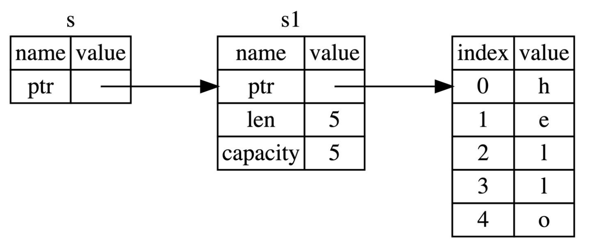

# Rust语言圣经笔记


## 1 开始

Rust特点：无 GC 且无需手动内存管理、性能高、工程性强、语言级安全性以及能同时得到工程派和学院派认可的语言。

（基于表达式的语言，非面向对象或函数式语言，所有权、借用、生命周期、智能指针）


包管理工具：cargo

```
cargo new project_name

cargo run //默认debug模式，编译快运行慢，有debug输出行
cargo build

cargo run --release //release模式，经过优化，编译慢运行快
cargo build --release

cargo check //快速的检查一下代码能否编译通过
```

- `Cargo.toml` 是**项目数据描述文件**，按照期望的方式进行构建、测试和运行。
- `Cargo.lock` 是**项目依赖详细清单**，一般不用修改它。当项目是一个可运行的程序时，就上传 `Cargo.lock`，如果是一个依赖库项目，那么请把它添加到 `.gitignore` 中。


注意：仔细阅读编译错误和警告。


## 2 Rust基础入门

### 2.2 基本类型

`isize` 和 `usize` 类型取决于程序运行的计算机 CPU 类型，主要应用场景是用作集合的索引。

在 `debug` 模式编译时，Rust 会检查整型溢出，若存在这些问题，则使程序在编译时 *panic*；使用 `--release` 参数进行 release 模式构建时，Rust **不**检测溢出。

要显式处理可能的溢出，可以使用标准库针对原始数字类型提供的这些方法：

- 使用 `wrapping_*` 方法在所有模式下都按照补码循环溢出规则处理，例如 `wrapping_add`
- 如果使用 `checked_*` 方法时发生溢出，则返回 `None` 值
- 使用 `overflowing_*` 方法返回该值和一个指示是否存在溢出的布尔值
- 使用 `saturating_*` 方法使值达到最小值或最大值

下面是一个演示`wrapping_*`方法的示例：

```rust
fn main() {
    let a : u8 = 255;
    let b = a.wrapping_add(20);
    println!("{}", b);  // 19
}
```


默认浮点类型是 `f64`。避免在浮点数上测试相等性。可以考虑用这种方式 `(0.1_f64 + 0.2 - 0.3).abs() < 0.00001` 。

```Rust
std::mem::size_of_val(&x)
```

当用 `!` 作函数返回类型的时候，表示该函数永不返回( diverge function )

### 2.3 所有权和借用

一个值（内存空间）只允许有一个所有者

#### 堆和栈

1 栈中的所有数据都必须占用已知且固定大小的内存空间；与栈不同，对于大小未知或者可能变化的数据，我们需要将它存储在堆上，堆是一种缺乏组织的数据结构。

2 栈数据往往可以直接存储在 CPU 高速缓存中，而堆数据只能存储在内存中，处理器处理和分配在栈上数据会比在堆上的数据更加高效。

3 因为堆上的数据缺乏组织，因此跟踪这些数据何时分配和释放是非常重要的，否则堆上的数据将产生内存泄漏 —— 这些数据将永远无法被回收。这就是 Rust **所有权系统**为我们提供的强大保障。

#### 以String为例——借用

```rust
let s1 = "hello"; // 类型为&str，是堆上数据“hello”的一个不可变引用，没有所有权。
let mut s2 = String::from("hello"); //动态字符串类型String（非基本类型），“hello”分配在堆上，s2对其有所有权。
let s3 = s2; //这里发生了借用，s2失效，s3继承其所有权。
println!("{}", s2);//Error！
let s4 = s1; //s1不会失效，s1和s4引用同一块内存。
let s5 = s3.clone();//深拷贝，s3仍然有效。
```

`String` 类型是一个复杂类型，由**存储在栈中的堆指针**、**字符串长度**、**字符串容量**共同组成，其中**堆指针**是最重要的。

**Rust 永远也不会自动创建数据的 “深拷贝“。**如果我们需要，可以使用一个叫做 `clone` 的方法（非基本类型需要，基本类型或是可copy类型深浅拷贝无区别）。


可copy类型：


注意：在函数调用中，参数是可copy类型则自动复制一份传入函数，函数结束后该值仍可用；而若是非可copy类型，则所有权转移，原变量不可用。


#### rust也可以引用（borrowing）



```rust
fn main() {
    let s1 = String::from("hello");
    let len = calculate_length(&s1);
    println!("The length of '{}' is {}.", s1, len);
}
fn calculate_length(s: &String) -> usize {
    s.len()
}
```

`s1` 的引用作为参数传递给 `calculate_length` 函数，而不是把 `s1` 的所有权转移给该函数。

**同一作用域，特定数据只能有一个可变引用**：

```rust
let mut s = String::from("hello");

let r1 = &mut s;
let r2 = &mut s;

println!("{}, {}", r1, r2); // Error！
```

这种限制的好处就是使 Rust 在编译期就避免数据竞争，数据竞争可由以下行为造成：

- 两个或更多的指针同时访问同一数据
- 至少有一个指针被用来写入数据
- 没有同步数据访问的机制

**可变引用与不可变引用不能同时存在：**

```rust
let mut s = String::from("hello");

let r1 = &s; // 没问题
let r2 = &s; // 没问题
let r3 = &mut s; // 大问题

println!("{}, {}, and {}", r1, r2, r3);
```

**Non-Lexical Lifetimes(NLL)**

引用的作用域 `s` 从创建开始，一直持续到它*最后一次使用的地方*，这个跟变量的作用域有所不同，变量的作用域从创建持续到某一个花括号 `}`

是对Rust老版本的一种改进，编译跟容易通过。


在 Rust 中编译器可以确保引用永远也不会变成悬垂状态（Dangling Reference）


### 2.4 复合类型


 
